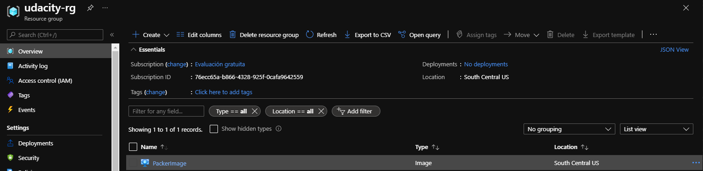

# Azure Infrastructure Operations Project: Deploying a scalable IaaS web server in Azure

## Table of Contents
* [Introduction](#Introduction)
* [Getting Started](#Getting-Started)
* [Install our dependencies](#Install-our-dependencies)
* [Deploy a policy](#Deploy-a-policy)
* [Create and configure our environment variables](#Create-and-configure-our-environment-variables)
* [Deploy the Packer template](#Deploy-the-Packer-template)
* [Deploy the infrastructure as code with Terraform](#Deploy-the-infrastructure-as-code-with-Terraform)
* [References](#References)

## Introduction
For this project, you will write a Packer template and a Terraform template to deploy a customizable, scalable web server in Azure.

Infrastructure as Code (IaC) is the management of infrastructure (networks, virtual machines, load balancers, and connection topology) in a descriptive model, using the same versioning as DevOps team uses for source code. Like the principle that the same source code generates the same binary, an IaC model generates the same environment every time it is applied. IaC is a key DevOps practice and is used in conjunction with continuous delivery.

For this project we will use Azure as our cloud provider, in conjunction with Terraform for our IaC needs, and Packer, which will help us with the creation of virtual machine images. 

We will use a Packer template (in JSON format), with a Terraform template to deploy a customizable, scalable web server in Azure.

## Getting Started
In this project we will follow the following steps:
1. Install our dependencies
2. Deploy a policy
3. Create and configure our environment variables
4. Deploy the Packer template
5. Deploy the infrastructure as code with Terraform

## Install our dependencies
1. Create an [Azure Account](https://portal.azure.com) 
2. Install the [Azure command line interface](https://docs.microsoft.com/en-us/cli/azure/install-azure-cli?view=azure-cli-latest)
3. Install [Packer](https://www.packer.io/downloads)
4. Install [Terraform](https://www.terraform.io/downloads.html)

## Deploy a policy
We will deploy a security policy that enforces that all the resources that we deploy have a tag, this is to have a better understanding of what each resource does. The rules of the policy are defined in the ```enforceTag.json``` file. To deploy the policy we write in our command line:
```bash
az policy definition create --name tagging-policy --mode indexed --rules enforceTag.json --description "Policy to enforce all indexed resources are tagged"
```

When we have done this, we should wait a few minutes and then enter the following command:
```bash
az policy assignment list
```

If everything went correctly, we should be able to see a json definition of our new policy:


We are ready to continue to the next step.

## Create and configure our environment variables
We will need to configure environment variables in our local computer to use the ```server.json``` Packer template. We will need to create an Azure resource group and then get 4 variables that we can obtain from the resource group.

### Login to Azure from Azure CLI
Ensure that you are logged in to your Azure Subscription

```bash
az login
```

### Create resource group
During the build process, Packer creates temporary Azure resources as it builds the source VM. To capture that source VM for use as an image, we must define a resource group. The output from the Packer build process is stored in this resource group.

```bash
az group create -n udacity-rg -l southcentralus
```

### Create Azure credentials
Packer authenticates with Azure using a service principal. An Azure service principal is a security identity that you can use with apps, services, and automation tools like Packer. We control and define the permissions as to what operations the service principal can perform in Azure.

```bash
az ad sp create-for-rbac --query "{ client_id: appId, client_secret: password, tenant_id: tenant }"
```

We will also need to obtain the Azure Subscription ID with the following command:

```bash
az account show --query "{ subscription_id: id }"
```

With this 4 variables identified, we can now go to the terminal and export the environment variables with the following commands:

```bash
export ARM_CLIENT_ID=your_client_id
export ARM_CLIENT_SECRET=your_client_secret
export ARM_SUBSCRIPTION_ID=your_suscription_id
export ARM_TENANT_ID=your_tenant_id
```

Once you have exported this environment variables, use the ```printenv``` command to check that they are properly configured:

```bash
printenv
```

We can now proceed with the exercise

## Deploy the Packer template

Now we can deploy our Packer template with the following command:

```bash
packer build server.json
```

If everything went correctly, we should be able to see an output similar to the following:

```bash
azure-arm: output will be in this color.

==> azure-arm: Running builder ...
==> azure-arm: Getting tokens using client secret
==> azure-arm: Getting tokens using client secret
    azure-arm: Creating Azure Resource Manager (ARM) client ...
==> azure-arm: WARNING: Zone resiliency may not be supported in South Central US, checkout the docs at https://docs.microsoft.com/en-us/azure/availability-zones/
==> azure-arm: Creating resource group ...
==> azure-arm:  -> ResourceGroupName : 'pkr-Resource-Group-tdjwawivpw'
==> azure-arm:  -> Location          : 'South Central US'
==> azure-arm:  -> Tags              :
==> azure-arm:  ->> tag : udacity
==> azure-arm: Validating deployment template ...
==> azure-arm:  -> ResourceGroupName : 'pkr-Resource-Group-tdjwawivpw'
==> azure-arm:  -> DeploymentName    : 'pkrdptdjwawivpw'
==> azure-arm: Deploying deployment template ...
==> azure-arm:  -> ResourceGroupName : 'pkr-Resource-Group-tdjwawivpw'
==> azure-arm:  -> DeploymentName    : 'pkrdptdjwawivpw'
==> azure-arm:
==> azure-arm: Getting the VM's IP address ...
==> azure-arm:  -> ResourceGroupName   : 'pkr-Resource-Group-tdjwawivpw'
==> azure-arm:  -> PublicIPAddressName : 'pkriptdjwawivpw'
==> azure-arm:  -> NicName             : 'pkrnitdjwawivpw'
==> azure-arm:  -> Network Connection  : 'PublicEndpoint'
==> azure-arm:  -> IP Address          : '23.98.177.25'
==> azure-arm: Waiting for SSH to become available...
==> azure-arm: Connected to SSH!
==> azure-arm: Provisioning with shell script: C:\Users\jorge\AppData\Local\Temp\packer-shell845834943
==> azure-arm: + echo Hello, World!
==> azure-arm: + nohup busybox httpd -f -p 80
==> azure-arm: Querying the machine's properties ...
==> azure-arm:  -> ResourceGroupName : 'pkr-Resource-Group-tdjwawivpw'
==> azure-arm:  -> ComputeName       : 'pkrvmtdjwawivpw'
==> azure-arm:  -> Managed OS Disk   : '/subscriptions/76ecc65a-b866-4328-925f-0cafa9642559/resourceGroups/pkr-Resource-Group-tdjwawivpw/providers/Microsoft.Compute/disks/pkrostdjwawivpw'
==> azure-arm: Querying the machine's additional disks properties ...
==> azure-arm:  -> ResourceGroupName : 'pkr-Resource-Group-tdjwawivpw'
==> azure-arm:  -> ComputeName       : 'pkrvmtdjwawivpw'
==> azure-arm: Powering off machine ...
==> azure-arm:  -> ResourceGroupName : 'pkr-Resource-Group-tdjwawivpw'
==> azure-arm:  -> ComputeName       : 'pkrvmtdjwawivpw'
==> azure-arm: Capturing image ...
==> azure-arm:  -> Compute ResourceGroupName : 'pkr-Resource-Group-tdjwawivpw'
==> azure-arm:  -> Compute Name              : 'pkrvmtdjwawivpw'
==> azure-arm:  -> Compute Location          : 'South Central US'
==> azure-arm:  -> Image ResourceGroupName   : 'udacity-rg'
==> azure-arm:  -> Image Name                : 'PackerImage'
==> azure-arm:  -> Image Location            : 'South Central US'
==> azure-arm: 
==> azure-arm: Deleting individual resources ...
==> azure-arm: Adding to deletion queue -> Microsoft.Compute/virtualMachines : 'pkrvmtdjwawivpw'
==> azure-arm: Adding to deletion queue -> Microsoft.Network/networkInterfaces : 'pkrnitdjwawivpw'
==> azure-arm: Adding to deletion queue -> Microsoft.Network/publicIPAddresses : 'pkriptdjwawivpw'
==> azure-arm: Adding to deletion queue -> Microsoft.Network/virtualNetworks : 'pkrvntdjwawivpw'
==> azure-arm: Attempting deletion -> Microsoft.Network/publicIPAddresses : 'pkriptdjwawivpw'
==> azure-arm: Waiting for deletion of all resources...
==> azure-arm: Attempting deletion -> Microsoft.Compute/virtualMachines : 'pkrvmtdjwawivpw'
==> azure-arm: Attempting deletion -> Microsoft.Network/virtualNetworks : 'pkrvntdjwawivpw'
==> azure-arm: Attempting deletion -> Microsoft.Network/networkInterfaces : 'pkrnitdjwawivpw'
==> azure-arm: Error deleting resource. Will retry.
==> azure-arm: Name: pkriptdjwawivpw
==> azure-arm: Error: network.PublicIPAddressesClient#Delete: Failure sending request: StatusCode=400 -- Original Error: Code="PublicIPAddressCannotBeDeleted" Message="Public IP address /subscriptions/76ecc65a-b866-4328-925f-0cafa9642559/resourceGroups/pkr-Resource-Group-tdjwawivpw/providers/Microsoft.Network/publicIPAddresses/pkriptdjwawivpw can not be deleted since it is still allocated to resource /subscriptions/76ecc65a-b866-4328-925f-0cafa9642559/resourceGroups/pkr-Resource-Group-tdjwawivpw/providers/Microsoft.Network/networkInterfaces/pkrnitdjwawivpw/ipConfigurations/ipconfig. In order to delete the public 
IP, disassociate/detach the Public IP address from the resource.  To learn how to do this, see aka.ms/deletepublicip." Details=[]
==> azure-arm:
==> azure-arm: Error deleting resource. Will retry.
==> azure-arm: Name: pkrvntdjwawivpw
==> azure-arm: Error: network.VirtualNetworksClient#Delete: Failure sending request: StatusCode=400 -- Original Error: Code="InUseSubnetCannotBeDeleted" Message="Subnet pkrsntdjwawivpw is in use by /subscriptions/76ecc65a-b866-4328-925f-0cafa9642559/resourceGroups/pkr-Resource-Group-tdjwawivpw/providers/Microsoft.Network/networkInterfaces/pkrnitdjwawivpw/ipConfigurations/ipconfig and cannot be deleted. In order to delete the subnet, delete all the resources within the subnet. See aka.ms/deletesubnet." Details=[]
==> azure-arm:
==> azure-arm: Attempting deletion -> Microsoft.Network/publicIPAddresses : 'pkriptdjwawivpw'
==> azure-arm: Attempting deletion -> Microsoft.Network/virtualNetworks : 'pkrvntdjwawivpw'
==> azure-arm: Error deleting resource. Will retry.
==> azure-arm: Name: pkriptdjwawivpw
==> azure-arm: Error: network.PublicIPAddressesClient#Delete: Failure sending request: StatusCode=400 -- Original Error: Code="PublicIPAddressCannotBeDeleted" Message="Public IP address /subscriptions/76ecc65a-b866-4328-925f-0cafa9642559/resourceGroups/pkr-Resource-Group-tdjwawivpw/providers/Microsoft.Network/publicIPAddresses/pkriptdjwawivpw can not be deleted since it is still allocated to resource /subscriptions/76ecc65a-b866-4328-925f-0cafa9642559/resourceGroups/pkr-Resource-Group-tdjwawivpw/providers/Microsoft.Network/networkInterfaces/pkrnitdjwawivpw/ipConfigurations/ipconfig. In order to delete the public 
IP, disassociate/detach the Public IP address from the resource.  To learn how to do this, see aka.ms/deletepublicip." Details=[]
==> azure-arm:
==> azure-arm: Error deleting resource. Will retry.
==> azure-arm: Name: pkrvntdjwawivpw
==> azure-arm: Error: network.VirtualNetworksClient#Delete: Failure sending request: StatusCode=400 -- Original Error: Code="InUseSubnetCannotBeDeleted" Message="Subnet pkrsntdjwawivpw is in use by /subscriptions/76ecc65a-b866-4328-925f-0cafa9642559/resourceGroups/pkr-Resource-Group-tdjwawivpw/providers/Microsoft.Network/networkInterfaces/pkrnitdjwawivpw/ipConfigurations/ipconfig and cannot be deleted. In order to delete the subnet, delete all the resources within the subnet. See aka.ms/deletesubnet." Details=[]
==> azure-arm:
==> azure-arm: Attempting deletion -> Microsoft.Network/publicIPAddresses : 'pkriptdjwawivpw'
==> azure-arm: Attempting deletion -> Microsoft.Network/virtualNetworks : 'pkrvntdjwawivpw'
==> azure-arm:  Deleting -> Microsoft.Compute/disks : '/subscriptions/76ecc65a-b866-4328-925f-0cafa9642559/resourceGroups/pkr-Resource-Group-tdjwawivpw/providers/Microsoft.Compute/disks/pkrostdjwawivpw'
==> azure-arm: Removing the created Deployment object: 'pkrdptdjwawivpw'
==> azure-arm: 
==> azure-arm: Cleanup requested, deleting resource group ...
==> azure-arm: Resource group has been deleted.
Build 'azure-arm' finished after 7 minutes 30 seconds.

==> Wait completed after 7 minutes 30 seconds

==> Builds finished. The artifacts of successful builds are:
--> azure-arm: Azure.ResourceManagement.VMImage:

OSType: Linux
ManagedImageResourceGroupName: udacity-rg
ManagedImageName: PackerImage
ManagedImageId: /subscriptions/76ecc65a-b866-4328-925f-0cafa9642559/resourceGroups/udacity-rg/providers/Microsoft.Compute/images/PackerImage
ManagedImageLocation: South Central US
```

And in the Azure portal we should be able to see the image "PackerImage" in our resource group.



## Deploy the infrastructure as code with Terraform

## References
- [What is Infrastructure as Code?](https://docs.microsoft.com/en-us/devops/deliver/what-is-infrastructure-as-code)
- [Azure](https://portal.azure.com)
- [Azure Command Line Interface](https://docs.microsoft.com/en-us/cli/azure/install-azure-cli?view=azure-cli-latest)
- [Packer](https://www.packer.io/downloads)
- [Terraform](https://www.terraform.io/downloads.html)
- [How to use Packer to create Linux virtual machine images in Azure](https://docs.microsoft.com/en-us/azure/virtual-machines/linux/build-image-with-packer)